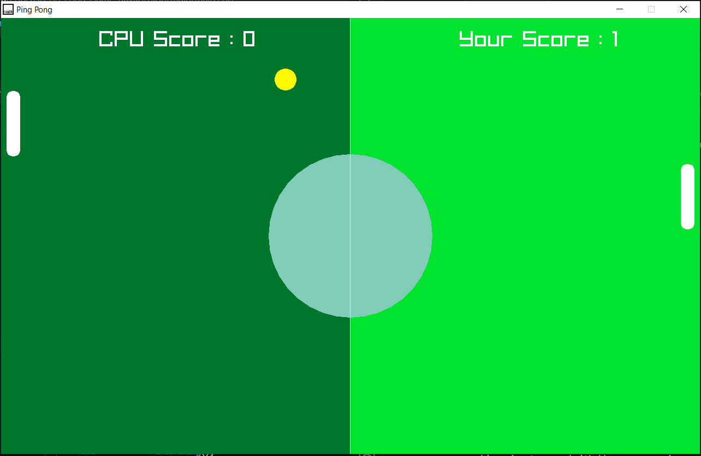
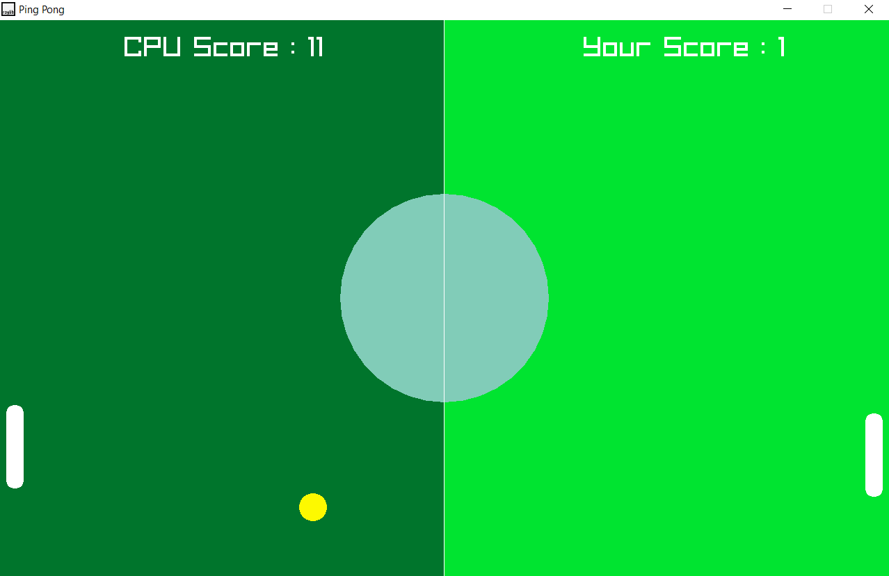

# pong_game_using_raylib_CPP

Tried to implement the classic Ping Pong game.
- Once ball passes left or right wall it again started from center
- Ball movement is random in any direction everytime it starts
- CPU movement is done by basic geometric understanding
- There is no condition as of now which decides who won

